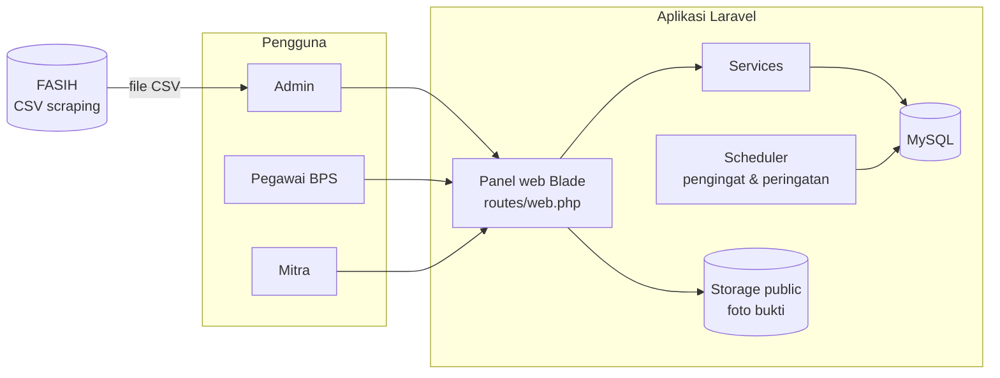
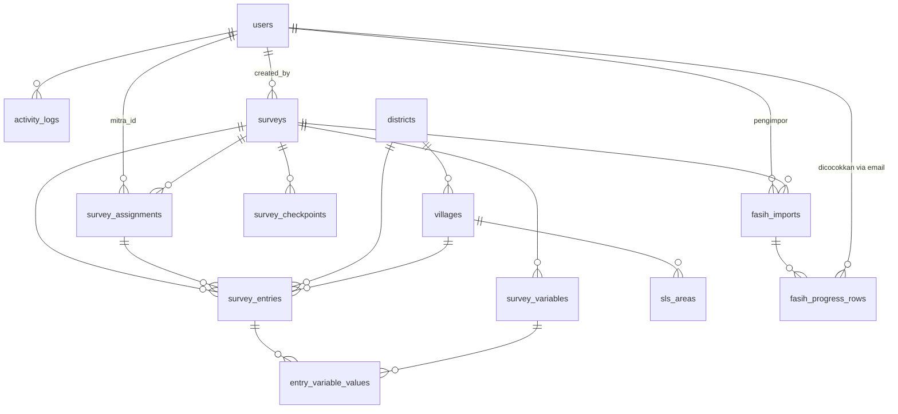
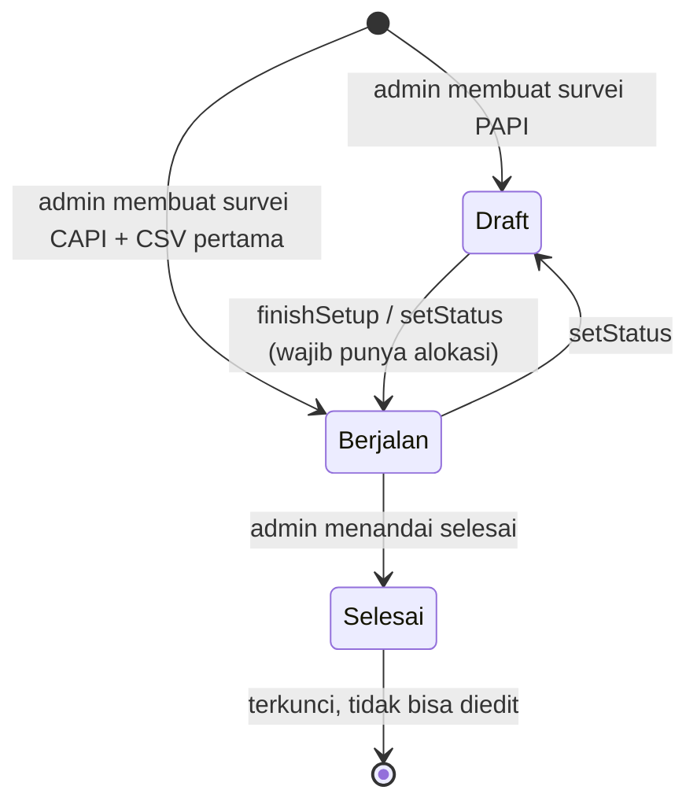
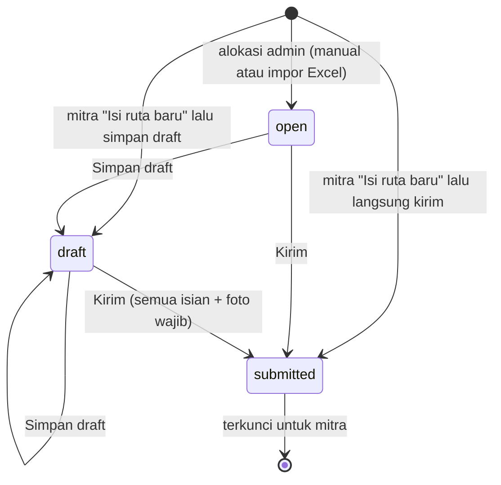
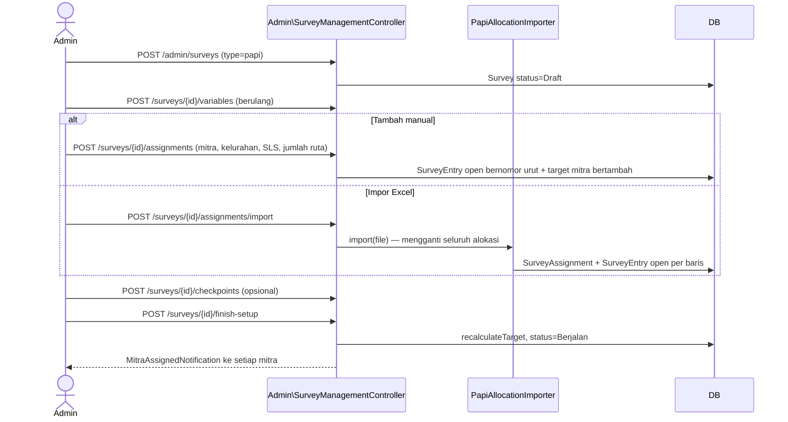
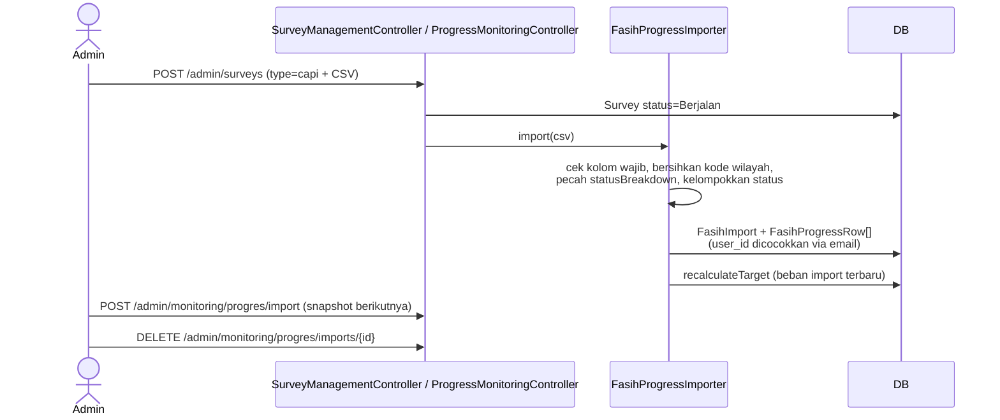
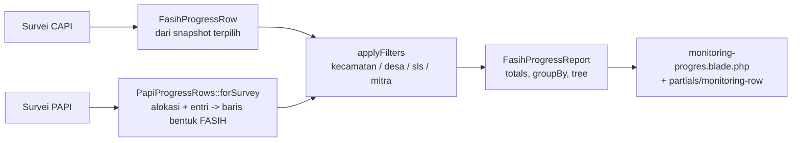
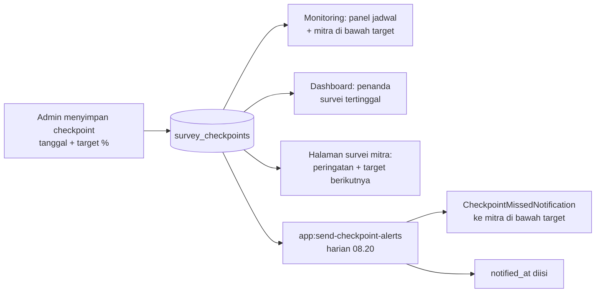
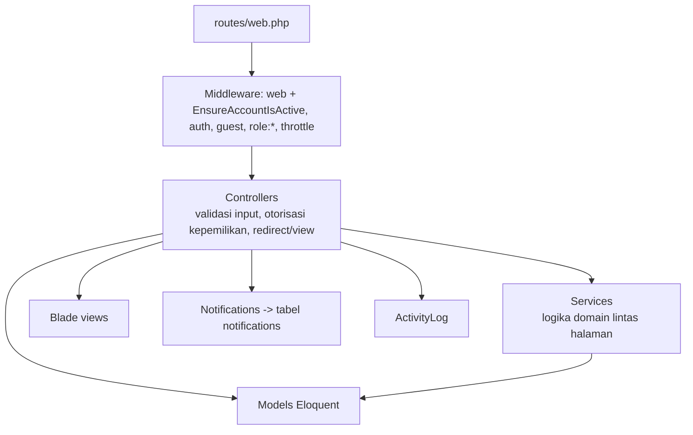

# Arsitektur SIMPROCA

Dokumen ini menjelaskan cara kerja SIMPROCA dari sisi kode: komponen yang ada, data yang disimpan, dan alur yang menghubungkan keduanya. Tujuannya supaya pengembang bisa memahami dan mengubah sistem tanpa harus menelusuri seluruh kode terlebih dahulu.

---

## 1. Gambaran umum

SIMPROCA adalah aplikasi web untuk memantau progres pencacahan survei BPS Kabupaten Kepulauan Seribu (kode wilayah `3101`). Sistem ini menangani dua metode pendataan:

| Metode | Sumber data progres | Yang mengisi |
| --- | --- | --- |
| **PAPI** (kertas) | Entri per rumah tangga (ruta) yang diisi mitra di panel web SIMPROCA | Mitra |
| **CAPI** (tablet/FASIH) | Snapshot CSV hasil scraping progres FASIH yang diimpor admin | Tidak ada; data berasal dari FASIH |

Kedua metode dirangkum dalam tampilan yang sama. Dashboard menampilkan ringkasan seluruh survei, sedangkan Monitoring menampilkan rincian satu survei per kecamatan, desa, SLS, dan pencacah.



---

## 2. Teknologi

| Lapisan | Teknologi |
| --- | --- |
| Bahasa & framework | PHP 8.2, Laravel 12 (struktur ramping Laravel 11+) |
| Autentikasi | Session Laravel (`Auth::attempt`), percobaan login dibatasi 10 kali per menit |
| Peran | `spatie/laravel-permission`, hanya bagian peran (middleware `role:`); permission tidak dipakai |
| Excel/CSV | `maatwebsite/excel` untuk impor alokasi, ekspor data, dan template |
| Tampilan | Blade dengan CSS dan JavaScript vanilla inline, **tanpa** build frontend (lihat §9) |
| Gambar | Ekstensi GD, dipakai seeder untuk membuat gambar contoh foto bukti |
| Database | MySQL untuk pengembangan dan produksi; SQLite in-memory untuk tes (`phpunit.xml`) |
| Notifikasi | Kanal `database`, dikirim langsung (tidak lewat antrean) |
| Cache, session | Driver `database` |
| Pengujian | PHPUnit 11 (feature test) |
| Format kode | Laravel Pint |

---

## 3. Peran dan hak akses

Ada tiga peran, semuanya memakai guard `web`.

| Peran | Prefix URL | Yang bisa dilakukan |
| --- | --- | --- |
| `admin` | `/admin` | Semua yang bisa dilakukan pegawai, ditambah: membuat, mengubah, dan menghapus survei; mengatur form isian, alokasi ruta, dan checkpoint PAPI; menjalankan atau menandai survei selesai; mengimpor dan menghapus data FASIH; mengelola pengguna; melihat daftar mitra dan log aktivitas |
| `pegawai_bps` | `/pegawai` | Hanya melihat: dashboard, monitoring, daftar dan detail survei, serta data entri PAPI beserta ekspornya |
| `mitra` | `/mitra` | Melihat survei yang ditugaskan, mengisi ruta PAPI (draft lalu kirim), dan melihat entri yang sudah dikirim |

Admin dan pegawai sama-sama menerima notifikasi saat mitra mengirim entri.

**Pembatasan akses** dilakukan di level grup route: `Route::prefix('admin')->middleware('role:admin')`, dan seterusnya ([routes/web.php](routes/web.php)). Kepemilikan data mitra dicek di controller. Contohnya, `MitraPanelController::authorizeEntryAccess()` memastikan entri milik mitra yang sedang login, belum berstatus Selesai, dan surveinya masih Berjalan.

**Aturan login:**
- Setelah login, pengguna diarahkan ke beranda perannya: `/admin/dashboard`, `/pegawai/dashboard`, atau `/mitra/dashboard`.
- Akun nonaktif atau tanpa peran ditolak dengan pesan yang jelas.
- Middleware `EnsureAccountIsActive` pada grup `web` langsung mengakhiri sesi yang sedang berjalan bila admin menonaktifkan akun atau mencabut perannya.
- Percobaan login dibatasi 10 kali per menit (`throttle:10,1`).

---

## 4. Struktur direktori

```
app/
├── Console/Commands/          Command terjadwal (pengingat, peringatan checkpoint, sinkron target)
├── Exports/                   Kelas ekspor Excel
├── Http/
│   ├── Controllers/Web/
│   │   ├── Admin/             Dashboard & pengguna, survei, daftar mitra, ganti password
│   │   ├── Mitra/             Panel mitra
│   │   ├── Pegawai/           Panel pegawai
│   │   ├── NotificationController.php        tandai dibaca & bersihkan notifikasi
│   │   ├── PapiEntriesController.php         dipakai admin & pegawai
│   │   └── ProgressMonitoringController.php  dipakai admin & pegawai
│   ├── Middleware/EnsureAccountIsActive.php
│   └── Requests/UpdatePasswordRequest.php
├── Models/
├── Notifications/             Notifikasi database
├── Providers/AppServiceProvider.php   Mengganti view pagination bawaan
└── Services/                  Logika domain yang dipakai beberapa controller
config/fasih.php               Pemetaan status FASIH ke Open/Draft/Submit
database/
├── migrations/
└── seeders/                   Peran, wilayah, SLS, akun, dan data demo
resources/views/
├── panel/
│   ├── layout.blade.php       Kerangka: sidebar, topbar, notifikasi, CSS dasar
│   ├── partials/              Komponen UI & palet (ui.blade.php), menu, baris monitoring, dsb.
│   ├── admin/                 Pengguna, log, daftar mitra, setup survei
│   ├── mitra/                 Dashboard, daftar survei, form isian, data entri
│   ├── pegawai/menu.blade.php
│   └── *.blade.php            Halaman bersama admin & pegawai
├── ui/login.blade.php         Halaman login
└── vendor/pagination/         View pagination kustom
routes/
├── web.php                    Semua route aplikasi
└── console.php                Jadwal scheduler
tests/Feature/                 Feature test per modul
```

**Pola halaman bersama.** Beberapa controller dan view dipakai oleh admin dan pegawai sekaligus. Controller mengirim `panelTitle`, `menuView`, `base` (`/admin` atau `/pegawai`), dan `canManage`. View memakai variabel tersebut untuk menyusun tautan dan menyembunyikan tombol kelola dari pegawai. Contohnya `panel/dashboard`, `panel/survey-index`, `panel/survey-show`, `panel/papi-entries`, `panel/survey-entry-detail`, dan `panel/monitoring-progres`. View `survey-entry-detail` juga dipakai mitra untuk melihat entri miliknya.

---

## 5. Model data

### 5.1 Diagram relasi



### 5.2 Tabel utama

| Tabel / Model | Isi | Kolom penting |
| --- | --- | --- |
| `users` / `User` | Semua akun, memakai soft delete | `email`, `phone`, `is_active` |
| `surveys` / `Survey` | Survei atau sensus | `type` (`papi`/`capi`), `title` (unik), `status` (`Draft`/`Berjalan`/`Selesai`), `start_date`, `end_date`, `total_target` |
| `survey_variables` / `SurveyVariable` | Variabel isian form PAPI | `name`, `data_type` (`text`/`number`), `example_format` |
| `survey_assignments` / `SurveyAssignment` | Alokasi mitra pada survei (unik per survei + mitra) | `target` (jumlah ruta), `current_progress` (penghitung entri terkirim) |
| `survey_entries` / `SurveyEntry` | Satu ruta PAPI | `entry_status`, `district_id`, `village_id`, `sls`, `no_urut_ruta`, `ppl`, `evidence_photo_path`, `submitted_at` |
| `entry_variable_values` / `EntryVariableValue` | Nilai variabel untuk satu entri | `value` (teks) |
| `survey_checkpoints` / `SurveyCheckpoint` | Target capaian bertahap survei PAPI | `checkpoint_date` (satu per tanggal), `target_percentage`, `notified_at` |
| `districts` / `District` | Kecamatan | `code` (7 digit, mis. `3101010`) |
| `villages` / `Village` | Desa/kelurahan | `code` (10 digit), `type` |
| `sls_areas` / `SlsArea` | Master SLS | `code` (14 digit), `name` |
| `fasih_imports` / `FasihImport` | Satu snapshot CSV FASIH per survei CAPI | `file_name`, `row_count` |
| `fasih_progress_rows` / `FasihProgressRow` | Baris progres per pencacah per SLS | `email`, `pencacah_name`, `district_code`, `village_code`, `sls_code`, `total_region` (beban), `open/draft/submit/other_count`, `status_breakdown` |
| `activity_logs` / `ActivityLog` | Jejak audit aksi pengguna | `action`, `description`, `meta` |
| `notifications` | Notifikasi database Laravel | `data` (JSON: `title`, `message`, `survey_id`/`entry_id`) |

### 5.3 Siklus status

**Status survei**



- **Draft**: survei belum terlihat oleh mitra dan tidak ikut dipantau di Monitoring. Survei Draft bisa dihapus dari daftar survei.
- **Berjalan**: survei tampil di akun mitra dan di Monitoring. Saat survei pertama kali dijalankan, mitra yang teralokasi menerima `MitraAssignedNotification`.
- **Selesai**: `ensureSurveyIsEditable()` menolak semua perubahan (403). Survei **hanya** menjadi Selesai bila admin menandainya; tidak ada proses yang menutupnya otomatis.

**Status entri PAPI** (`SurveyEntry::STATUS_*`)



| Status | Label (`STATUS_LABELS`) | Arti |
| --- | --- | --- |
| `open` | Open | Ruta sudah dialokasikan, tetapi belum disentuh mitra |
| `draft` | Draft | Isian disimpan sebagian |
| `submitted` | Selesai | Identitas, semua variabel, dan foto bukti lengkap. Entri terkunci |

Entri yang identitasnya berasal dari alokasi (`hasAllocatedIdentity()`) tidak bisa diubah wilayah, SLS, atau nomor rutanya oleh mitra. Nilai dari request ditimpa dengan nilai yang sudah tersimpan.

### 5.4 Target, progres, dan jadwal

**Target dan capaian**
- **Target survei** (`surveys.total_target`) dihitung ulang oleh `Survey::recalculateTarget()`:
  - PAPI: jumlah `target` pada seluruh alokasi.
  - CAPI: jumlah `total_region` pada import FASIH terbaru.
- **Capaian di daftar survei** (`SurveyProgressSummary::attach()`):
  - PAPI: jumlah entri `submitted`.
  - CAPI: jumlah `submit_count` pada import FASIH terbaru.
- **Dashboard dan Monitoring** menghitung dari baris progres yang sama (lihat §6.4), sehingga angkanya selalu cocok dengan daftar survei.
- **`survey_assignments.current_progress`** adalah penghitung yang bertambah 1 setiap kali entri dikirim. Nilai ini dipakai untuk pengurutan, pengingat, peringatan checkpoint, dan persentase per mitra (`SurveyAssignment::progressPercent()`).
- **Target mitra tidak boleh lebih kecil** dari jumlah ruta yang sudah ia pegang (`ensureTargetCoversEntries()`).

**Jadwal dan checkpoint** (model `Survey`)
- `elapsedPercent()`: persentase periode survei yang sudah berjalan sampai hari ini (Asia/Jakarta).
- `passedCheckpoint()` dan `nextCheckpoint()`: checkpoint terakhir yang sudah lewat, dan checkpoint terdekat yang belum lewat (termasuk hari ini).
- `isBehindSchedule($persen)`: survei berjalan dianggap **tertinggal** bila capaiannya di bawah target checkpoint terakhir yang sudah lewat. Kalau survei belum punya checkpoint, patokannya porsi waktu yang sudah berjalan, dengan toleransi 10 poin.
- `SurveyAssignment::isBelow($checkpoint)`: capaian seorang mitra di bawah target checkpoint.

---

## 6. Alur utama

### 6.1 Menyiapkan survei PAPI (admin)

Setup survei PAPI punya empat langkah. Stepper di `admin/surveys/setup-header.blade.php` menampilkan langkah-langkah ini:

1. **Informasi**: judul (unik), periode, dan deskripsi. Survei disimpan sebagai Draft.
2. **Form isian**: variabel yang diisi mitra (`text` atau `number`, dengan contoh pengisian). Tersedia juga template spreadsheet progres.
3. **Alokasi mitra**: menentukan ruta yang dipegang tiap mitra. Ada dua cara (dijelaskan di bawah). Tombol **Selesai setup** (`finishSetup`) ada di langkah ini: survei dijalankan dan mitra menerima notifikasi.
4. **Checkpoint** (opsional): target capaian bertahap selama periode survei.



**Tambah manual** (`storeAssignment`)
- Admin memilih mitra, kelurahan, SLS, PPL (opsional), dan jumlah ruta.
- Sistem langsung membuat ruta `open` dengan nomor urut yang **melanjutkan nomor terakhir di SLS tersebut**. Contohnya, kalau SLS itu sudah punya ruta sampai nomor 7, 3 ruta baru bernomor 8–10.
- Nomor urut maksimal 99 per SLS, karena nomor ruta hanya 2 digit.
- Target mitra bertambah sesuai jumlah ruta. Kalau survei sudah berjalan, mitra baru langsung menerima notifikasi.
- Target yang sudah ada bisa diubah (`updateAssignment`) selama tidak lebih kecil dari jumlah ruta yang sudah dipegang mitra.

**Impor Excel** ([PapiAllocationImporter](app/Services/PapiAllocationImporter.php))
- Satu baris Excel mewakili satu ruta. Kolom yang dikenali: `kode prov`, `kode kab`, `kelurahan`, `email` (mitra), `sls`, dan `no urut ruta`. Variasi penulisan judul kolom dinormalkan oleh `columnName()`.
- Setiap baris divalidasi:
  - kode provinsi harus `31` dan kode kabupaten `01`;
  - kelurahan harus ada di master;
  - email harus milik mitra aktif;
  - nomor ruta berupa angka 1–99;
  - tidak boleh ada ruta ganda (kombinasi desa + SLS + nomor ruta).

  Satu baris saja yang salah membatalkan seluruh impor, dengan maksimal 10 galat dilaporkan sekaligus.
- **Impor selalu mengganti seluruh alokasi survei.** Impor ditolak kalau mitra sudah mengisi sebagian ruta (ada entri selain `open`); dalam kondisi itu admin memakai Tambah manual.
- Hanya mitra yang belum pernah dialokasikan yang menerima notifikasi penugasan.

**Checkpoint** (`storeCheckpoint`, `deleteCheckpoint`)
- Tanggal checkpoint harus berada di dalam periode survei, dan targetnya 1–100%.
- Setiap tanggal hanya punya satu checkpoint. Menyimpan tanggal yang sama akan memperbarui targetnya dan mengosongkan `notified_at`, sehingga peringatannya dikirim ulang.

### 6.2 Pengisian entri oleh mitra

Menu mitra terdiri dari **Dashboard**, **Daftar Survei**, dan **Data Entri** ([MitraPanelController](app/Http/Controllers/Web/Mitra/MitraPanelController.php)):

1. **Dashboard** berisi ringkasan survei yang dipegang mitra, baik PAPI dari alokasi maupun CAPI dari data FASIH dengan email yang sama (`MitraSurveyHoldings`). Survei Draft tidak ditampilkan.
2. **Daftar Survei** (`/mitra/surveys`) memisahkan survei Berjalan dan Selesai. Halaman satu survei (`/mitra/surveys/{id}`) menampilkan:
   - progres mitra;
   - peringatan kalau capaiannya di bawah checkpoint yang sudah lewat, beserta jumlah ruta yang kurang;
   - target checkpoint berikutnya;
   - daftar ruta dalam kelompok Draft, Open, dan Selesai.
3. Mitra membuka ruta `open`/`draft` (`/mitra/entries/{id}/edit`). Mitra juga bisa membuat ruta baru selama jumlah entri masih di bawah target (`hasUnallocatedSlot()`).
4. `persistEntry()` membedakan dua tombol:
   - **Simpan draft**: semua field boleh kosong.
   - **Kirim** (`action=submit`): kecamatan, desa, SLS, nomor ruta, semua variabel, dan foto (gambar, maks. 5 MB) wajib diisi. Variabel `number` divalidasi dengan pola angka.
5. Penyimpanan dibungkus transaksi. Entri dan `entry_variable_values` di-upsert. Saat dikirim, `current_progress` bertambah 1, admin dan pegawai aktif menerima `NewEntrySubmittedNotification` (`notifyStaff()`), dan aksi dicatat di `activity_logs`.
6. **Data Entri** (`/mitra/data-entri`) menampilkan entri yang sudah dikirim, dengan filter survei dan pencarian. Detailnya (`/mitra/data-entri/{id}`) hanya bisa dilihat.
7. Foto disimpan di disk `public`, folder `survey-evidence/`, dan ditampilkan lewat `asset('storage/...')`. Karena itu `php artisan storage:link` wajib dijalankan.

### 6.3 Survei CAPI dan impor FASIH



Rincian impor FASIH ([FasihProgressImporter](app/Services/FasihProgressImporter.php)):
- **Kolom:** wajibnya `email`, `regionCode`, `totalRegion`, dan `statusBreakdown`. Kolom `namaPetugas` bersifat opsional dan dipakai sebagai nama pencacah.
- **Kode wilayah:** `regionCode` ditulis FASIH sebagai formula Excel (`="3101020001000600"`), jadi dibersihkan dulu sebelum dipecah menjadi kode kecamatan, desa, dan SLS.
- **Status:** `statusBreakdown`, misalnya `APPROVED BY Pengawas:127 | DRAFT:22`, dijumlahkan ke kelompok Open, Draft, dan Submit sesuai [config/fasih.php](config/fasih.php). Status yang tidak terdaftar masuk ke "Lainnya".
- **Snapshot:** setiap impor disimpan sebagai snapshot terpisah. Monitoring memakai snapshot terbaru, tetapi snapshot lama tetap bisa dipilih. Menghapus snapshot akan menghitung ulang target survei.

### 6.4 Monitoring progres (admin dan pegawai)

[ProgressMonitoringController](app/Http/Controllers/Web/ProgressMonitoringController.php) menyamakan bentuk data dari kedua sumber sebelum ditampilkan:



- **Baris PAPI.** `PapiProgressRows` mengubah alokasi dan entri PAPI menjadi objek `FasihProgressRow` yang tidak disimpan ke database. Satu ruta dihitung sebagai satu beban. Entri Selesai masuk Submit, Draft masuk Draft, dan sisanya masuk Open. Sisa target yang belum punya wilayah diberi kode kecamatan `3101000`: tetap dihitung di total, tetapi tidak muncul sebagai baris wilayah. Baris CAPI di luar master wilayah dibuang.
- **Tabel bertingkat** (`FasihProgressReport::tree()`, digambar oleh `partials/monitoring-row`):
  - **mode wilayah**: kecamatan › desa › SLS, bisa dibuka dan ditutup mulai dari tingkat yang sedang dilihat;
  - **mode mitra**: pencacah › SLS yang dipegangnya.

  Breadcrumb menyimpan jejak filter.
- **Grafik entri harian (khusus PAPI).** Satu minggu kalender (Senin–Minggu) per tampilan. Parameter `minggu` menggeser tampilan mundur sampai minggu pertama periode survei.
- **Panel jadwal dan checkpoint (khusus PAPI).** Panel ini menampilkan apakah survei tertinggal (`isBehindSchedule`), dengan patokan checkpoint terakhir yang sudah lewat atau porsi waktu berjalan. Mitra yang capaiannya di bawah checkpoint itu ditampilkan beserta kekurangannya (`checkpointStatus()`).
- **Ekspor Excel** mengikuti tingkat dan filter yang sedang aktif.
- **Akses:** hanya survei berstatus Berjalan yang dipantau. Pegawai hanya bisa melihat, sedangkan impor dan hapus snapshot hanya tersedia untuk admin.

### 6.5 Data Entri PAPI (admin dan pegawai)

[PapiEntriesController](app/Http/Controllers/Web/PapiEntriesController.php) menyediakan:

- **Tabel entri** (`/{base}/entri-papi`) untuk satu survei PAPI:
  - Tab status: Selesai, Draft, Belum diisi, dan Semua.
  - Pencarian berdasarkan nama/email mitra, kelurahan, SLS, atau nomor ruta, ditambah rentang tanggal diperbarui.
  - Setiap kolom bisa diurutkan, termasuk kolom variabel (`sort=var_{id}`). Hanya kunci dalam whitelist `SORTABLE` yang diterima.
  - Pagination 25 baris per halaman, dengan tombol **Detail** di setiap baris.
  - Foto bukti tidak tampil di tabel; foto hanya ada di halaman Detail.
- **Detail entri** (`/{base}/entri-papi/{id}`) menampilkan identitas ruta, semua nilai variabel, dan foto bukti.
- **Ekspor** (`/{base}/entri-papi/export?format=xlsx|csv`) memakai filter dan urutan yang sama seperti tabel. Nilai variabel angka diekspor sebagai angka, dan foto disertakan dalam bentuk URL (`PapiEntriesExport`).

### 6.6 Dashboard

**Dashboard admin dan pegawai** adalah ringkasan **seluruh survei sekaligus** dan tidak punya filter survei. Rincian satu survei dibuka lewat Monitoring. Datanya disusun oleh `SurveyDashboardOverview::build()`, yang memakai baris progres yang sama dengan Monitoring, sehingga angkanya selalu cocok. Isinya:

- **Empat kartu angka kunci:**
  - kartu navy "Capaian survei berjalan", dengan bar Submit/Draft/Open/Lainnya;
  - status pendataan;
  - entri PAPI selesai per hari pada minggu berjalan (Senin–Minggu, zona Asia/Jakarta);
  - jumlah survei per status dan metode, beserta tenggat terdekat.
- **Capaian per survei:** sisa hari menuju tenggat, bar Submit + Draft + Open, dan penanda merah bila survei tertinggal dari checkpoint atau jadwal. Tersedia filter status di sisi klien.
- **Progres per kecamatan:** gabungan seluruh survei berjalan, bisa dibuka sampai tingkat desa. Beban PAPI yang belum punya wilayah disebutkan terpisah.
- **Mitra belum update:** alokasi survei berjalan tanpa entri selesai (`submitted_at`) dalam 3 hari, beserta jumlah alokasi yang sudah lewat tenggat. Tersedia pencarian dan halaman.

Admin dan pegawai melihat dashboard yang sama; perbedaannya hanya tombol "Buat survei" untuk admin (`canManage`).

**Dashboard mitra** dijelaskan di §6.2.

### 6.7 Checkpoint dan peringatan

Checkpoint menghubungkan beberapa bagian sistem:



`app:send-checkpoint-alerts` memproses checkpoint yang tanggalnya sudah lewat, `notified_at`-nya masih kosong, dan surveinya Berjalan. Kalau satu survei punya beberapa checkpoint yang terlewat sekaligus, mitra hanya diperingatkan untuk checkpoint yang terbaru. Setelah itu semua checkpoint tersebut ditandai `notified_at`, sehingga peringatan tidak terkirim dua kali.

### 6.8 Administrasi

- **Pengguna** (`AdminDashboardController::users/storeUser/updateUser/deleteUser`): CRUD akun dengan filter peran dan pencarian. Setiap akun hanya punya satu peran (`syncRoles`). Hapus akun memakai soft delete.
- **Daftar mitra** (`MitraDirectoryController`): daftar mitra beserta survei yang sedang dan sudah dipegang (`MitraSurveyHoldings`).
- **Log aktivitas** (`/admin/logs`): isi `activity_logs` dengan filter pengguna, aksi, dan tanggal.
- **Ganti password** (`POST /profile/password`): tersedia untuk semua peran dari halaman profil, dengan wajib memasukkan password lama.
- **Notifikasi** (`NotificationController`): semua notifikasi otomatis ditandai dibaca saat panel notifikasi dibuka, dan bisa dibersihkan sekaligus.

---

## 7. Lapisan kode



Konvensi yang dipakai di kode ini:

- **Validasi** umumnya ditulis langsung di controller dengan `$request->validate()`, lengkap dengan pesan dan nama atribut berbahasa Indonesia. Form request hanya dipakai untuk ganti password.
- **Service** dipakai untuk logika yang dibutuhkan lebih dari satu controller atau yang cukup kompleks untuk diuji sendiri. Service disuntikkan lewat method injection atau constructor.
- **Routing** memakai URL eksplisit (`/admin/surveys/{survey}`) dan belum memakai named route.
- **Route lama** yang sudah digabung ke menu baru dipertahankan sebagai redirect, supaya bookmark dan tautan di notifikasi lama tetap bekerja.

### 7.1 Daftar service

| Service | Tanggung jawab | Dipakai oleh |
| --- | --- | --- |
| `FasihProgressImporter` | Parse dan simpan CSV FASIH sebagai snapshot | Buat survei CAPI, impor di Monitoring |
| `FasihProgressReport` | Total, pengelompokan, dan pohon baris per kecamatan/desa/SLS/mitra; nama wilayah dan pencacah; filter drill-down | Monitoring, dashboard |
| `PapiProgressRows` | Mengubah alokasi dan entri PAPI menjadi baris berbentuk FASIH | Monitoring, dashboard |
| `PapiAllocationImporter` | Validasi dan impor template alokasi ruta PAPI (mengganti alokasi lama) | Halaman alokasi admin |
| `SurveyProgressSummary` | Menempelkan `progress_count/target/percent` ke koleksi survei | Daftar survei, dashboard |
| `SurveyDashboardOverview` | Menyusun seluruh data dashboard admin dan pegawai | Dashboard |
| `MitraSurveyHoldings` | Survei yang dipegang tiap mitra (PAPI + CAPI) | Dashboard dan daftar survei mitra, daftar mitra |

### 7.2 Daftar controller

| Controller | Route |
| --- | --- |
| `Web\Admin\AdminDashboardController` | `/admin/dashboard`, `/admin/users*`, `/admin/logs` |
| `Web\Admin\SurveyManagementController` | `/admin/surveys*`: CRUD, variabel, alokasi, checkpoint, status |
| `Web\Admin\MitraDirectoryController` | `/admin/mitra*` |
| `Web\Admin\UserManagementController` | `/profile/password` |
| `Web\Pegawai\PegawaiPanelController` | `/pegawai/dashboard`, `/pegawai/surveys*` |
| `Web\Mitra\MitraPanelController` | `/mitra/*` |
| `Web\ProgressMonitoringController` | `/{admin,pegawai}/monitoring/progres*` |
| `Web\PapiEntriesController` | `/{admin,pegawai}/entri-papi*` |
| `Web\NotificationController` | `/notifications/read`, `DELETE /notifications` |

Login, logout, dan halaman `/` ditulis sebagai closure di [routes/web.php](routes/web.php).

---

## 8. Ekspor dan impor file

| Kelas | Arah | Isi |
| --- | --- | --- |
| `AssignmentTemplateExport` | Unduh | Template alokasi PAPI, berisi contoh mitra dan daftar kelurahan |
| `PapiEntriesExport` | Unduh | Data entri PAPI (xlsx/csv) |
| `EntriesExport` | Unduh | Rekap Monitoring per tingkat |
| Kelas anonim di `downloadVariableTemplate` | Unduh | Template progres berdasarkan variabel survei |
| `PapiAllocationImporter` | Unggah | xlsx/xls/csv, maks. 10 MB |
| `FasihProgressImporter` | Unggah | csv, maks. 10 MB |

---

## 9. Frontend

- **Layout:** semua halaman panel memakai `resources/views/panel/layout.blade.php`, yang menyediakan:
  - sidebar menu per peran, yang di HP menjadi panel geser;
  - topbar dengan dropdown notifikasi (8 terbaru) dan menu profil;
  - mode gelap (`data-theme`);
  - toast untuk flash message.
- **Komponen bersama** ada di `panel/partials/ui.blade.php`, misalnya kelas `.pnl`, `.tbl`, `.b`, `.bdg`, `.seg`, `.empty`, dan blok navy `.hero-nv`. CSS khusus halaman diletakkan di `@push('head')`.
- **Palet warna sistem** didefinisikan satu kali di `ui.blade.php`, lengkap dengan varian mode gelap. Halaman lain memakai token ini dan tidak menulis kode warna sendiri:
  - **Navy** (`--navy`, `--navy-muted`, dan turunannya) untuk blok ringkasan, kartu sorotan, ikon, dan tombol `.b-navy`.
  - **Warna status progres**: `--st-submit` hijau, `--st-draft` oranye, `--st-open` abu-abu, `--st-other` biru muda, dan `--st-late` merah. Varian teksnya `--st-*-ink`, dan swatch legendanya `.sw.submit`, `.sw.draft`, `.sw.open`, dan `.sw.other`.
  - **Aturan bar progres**: segmen Submit selalu hijau, disusul Draft lalu Open. Penilaian capaian (≥90% hijau, ≥70% biru, ≥50% oranye, di bawahnya merah) hanya ditampilkan pada pil persentase `.t-good`, `.t-ok`, `.t-warn`, dan `.t-bad`.
- **Tanpa build:** proyek tidak memakai Node.js, Vite, Tailwind, atau library grafik. Semua grafik dibuat dengan HTML dan CSS. Skrip `composer run dev` menjalankan server, scheduler, dan log sekaligus lewat `npx concurrently` (opsional, butuh Node.js).
- **Pagination** memakai view kustom `vendor/pagination/custom`, yang didaftarkan di `AppServiceProvider` karena view bawaan bergantung pada Tailwind.
- **Interaksi kecil** (baris tabel yang bisa diklik, tabel bertingkat, filter status, pencarian mitra) ditulis dengan JavaScript vanilla di `@push('scripts')`.

---

## 10. Notifikasi dan scheduler

Semua notifikasi memakai kanal `database` dan dikirim **langsung** saat kejadiannya terjadi. Worker antrean tidak diperlukan untuk notifikasi.

| Notifikasi | Penerima | Pemicu |
| --- | --- | --- |
| `MitraAssignedNotification` | Mitra | Survei PAPI dijalankan, atau mitra baru dialokasikan (manual atau impor) pada survei Berjalan |
| `NewEntrySubmittedNotification` | Seluruh admin dan pegawai aktif | Mitra mengirim entri |
| `DailyProgressReminderNotification` | Mitra aktif yang masih punya alokasi belum tuntas di survei berjalan | Scheduler, harian 08.00 |
| `DeadlineReminderNotification` | Mitra aktif yang belum mencapai target pada survei berjalan | Scheduler, harian 08.15, untuk survei yang berakhir H-3 |
| `CheckpointMissedNotification` | Mitra aktif yang capaiannya di bawah checkpoint yang sudah lewat | Scheduler, harian 08.20 (§6.7) |

Tautan notifikasi di dropdown ditentukan oleh layout. Untuk admin dan pegawai, tautannya menuju detail entri (`entry_id`); untuk mitra, menuju halaman survei (`survey_id`).

Jadwal didefinisikan di [routes/console.php](routes/console.php):

| Command | Jadwal | Fungsi |
| --- | --- | --- |
| `app:send-daily-progress-reminder` | Harian 08.00 | Pengingat harian |
| `app:send-deadline-reminder` | Harian 08.15 | Pengingat H-3 |
| `app:send-checkpoint-alerts` | Harian 08.20 | Peringatan checkpoint |
| `app:sync-survey-status` | Setiap jam | Menghitung ulang total target survei berjalan. Status tidak diubah |

Scheduler harus dijalankan: `php artisan schedule:work` saat pengembangan, atau cron `php artisan schedule:run` setiap menit di server.

---

## 11. Audit

Aksi yang mengubah data dicatat di `activity_logs` dengan kode aksi bertitik:

| Kode aksi | Keterangan |
| --- | --- |
| `admin.survey.create`, `admin.survey.update`, `admin.survey.delete` | Pengelolaan survei |
| `admin.survey.allocation_import` | Impor alokasi Excel |
| `admin.fasih.import`, `admin.fasih.delete` | Snapshot FASIH |
| `admin.user.create`, `admin.user.update`, `admin.user.delete` | Pengelolaan pengguna |
| `mitra.entry.submit` | Mitra mengirim entri |

---

## 12. Seeder dan data awal

`php artisan migrate --seed` menjalankan `DatabaseSeeder` dengan urutan berikut:

1. `RolePermissionSeeder`: peran `admin`, `pegawai_bps`, dan `mitra` (guard `web`), tanpa permission.
2. `RegionSeeder`: 2 kecamatan beserta desa/pulau di Kepulauan Seribu, lengkap dengan kode BPS.
3. `SlsAreaSeeder`: master SLS.
4. Akun inti dan akun pegawai/mitra tambahan.
5. `DemoDataSeeder`:
   - survei PAPI **SUSENAS** beserta variabel, alokasi, entri, dan checkpoint;
   - survei CAPI **Sensus Ekonomi 2026** tanpa data progres (datanya diisi dengan mengimpor CSV FASIH);
   - log aktivitas contoh.

   Entri dibuat tanpa melebihi target mitra, dan satu mitra dibuat tuntas 100%. Foto bukti demo dibuat sebagai gambar contoh di disk `public` (membutuhkan GD).
6. `DummyAccountSeeder`: akun pencacah dari data FASIH dan pegawai rekaan. Seeder ini **tidak** dijalankan di environment `testing`.

Akun bawaan memakai kata sandi `password123`: `admin@bps.go.id`, `pegawai@bps.go.id`, dan `mitra@bps.go.id`. Ganti semuanya sebelum sistem dipakai sungguhan.

---

## 13. Pengujian

Ada 63 feature test PHPUnit di `tests/Feature`. Semuanya memakai `RefreshDatabase`, dan sebagian menjalankan seeder. Base `TestCase` memalsukan disk `public`, sehingga tes tidak pernah menulis ke storage aplikasi.

| File | Cakupan |
| --- | --- |
| `AdminModuleFlowTest` | Survei, variabel, alokasi, validasi target, status, pengguna, log, dan dashboard admin |
| `ManualAllocationTest` | Alokasi manual per SLS dengan nomor urut, dan hapus survei Draft |
| `PapiAllocationImportTest` | Template, validasi, dan penggantian alokasi lewat impor |
| `CheckpointFlowTest` | Pengelolaan checkpoint, peringatan hanya untuk mitra di bawah target (sekali saja), dan tampilannya di halaman mitra serta Monitoring |
| `PegawaiModuleFlowTest` | Menu lihat-saja pegawai, dashboard, dan data entri PAPI beserta ekspornya |
| `MitraModuleFlowTest` | Alur entri Open → Draft → Selesai, validasi angka, batas target, dan pembatasan akses |
| `FasihMonitoringTest` | Impor CSV FASIH, tampilan Monitoring, tabel bertingkat, dan ekspor |
| `DashboardSummaryTest` | Angka ringkasan dashboard sama dengan Monitoring, dan penanda survei terlambat |
| `NotificationFlowTest` | Notifikasi penugasan dan entri baru, serta tandai dibaca dan bersihkan |
| `ScheduledCommandsTest` | Penerima pengingat harian dan H-3, serta sinkron target yang tidak mengubah status |
| `LoginTest` | Beranda per peran, penolakan akun nonaktif atau tanpa peran, sesi yang langsung berakhir, dan pembatasan percobaan login |
| `EndToEndModuleConnectionTest` | Alur lintas peran dari admin → mitra → pegawai |
| `DummyAccountSeederTest` | Seeder akun uji |
| `DemoDataSeederTest` | Data demo konsisten: tidak ada ruta ganda, entri tidak melebihi target, penghitung progres cocok, foto tersedia, dan tanpa permission |

Perintah: `php artisan test --compact`, atau `--filter=NamaTes` untuk menjalankan satu tes.

---

## 14. Menjalankan secara lokal

```bash
composer install
cp .env.example .env              # lalu atur DB_* ke MySQL
php artisan key:generate
php artisan migrate --seed
php artisan storage:link          # wajib agar foto bukti bisa tampil
php artisan serve                 # http://127.0.0.1:8000
php artisan schedule:work         # terminal terpisah: pengingat & peringatan checkpoint
```

Untuk produksi, atur `APP_DEBUG=false` dan jadwalkan `php artisan schedule:run` setiap menit.

---

## 15. Catatan teknis dan utang teknis

Hal-hal di bawah ini perlu diketahui sebelum mengubah bagian terkait:

1. **Dua sumber progres PAPI.** `current_progress` adalah penghitung yang bertambah saat entri dikirim, sedangkan daftar survei, dashboard, dan Monitoring menghitung langsung jumlah entri `submitted`. Checkpoint dan pengingat memakai penghitung. Kedua angka bisa berbeda kalau ada entri yang dihapus atau alokasi yang diganti.
2. **Antrean tidak dipakai.** `QUEUE_CONNECTION=database` beserta tabel `jobs`, `job_batches`, dan `failed_jobs` masih ada sebagai bawaan Laravel, tetapi saat ini tidak ada notifikasi atau job yang masuk antrean. Tabel `password_reset_tokens` juga bawaan dan belum dipakai karena belum ada fitur lupa password.
3. **`survey_entries.kode_nks`** ditampilkan di detail entri bila terisi, tetapi tidak diisi oleh form mitra maupun impor alokasi; saat ini hanya data demo yang memilikinya.
