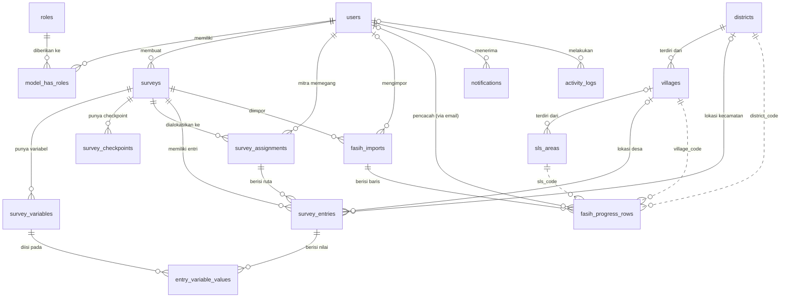
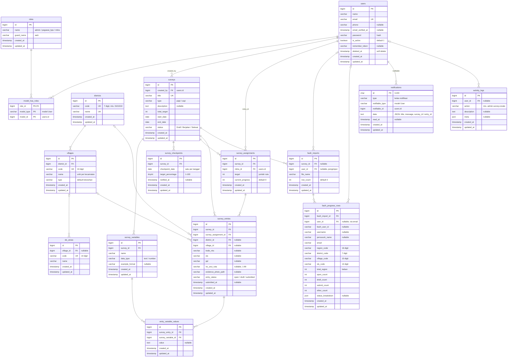

# Rancangan ERD SIMPROCA

Dokumen ini menggambarkan rancangan basis data SIMPROCA: entitas, atribut, relasi antarentitas, dan aturan integritas datanya. Isinya disusun dari skema database yang berjalan (MySQL, database `simproca`) setelah seluruh migration diterapkan.

Tabel bawaan framework yang tidak menyimpan data domain (sesi, cache, antrean, dan migration) tidak digambar di ERD; daftarnya ada di §7.

---

## 1. Ringkasan entitas

| Kelompok | Entitas | Peran dalam sistem |
| --- | --- | --- |
| Pengguna & akses | `users`, `roles`, `model_has_roles` | Akun admin, pegawai BPS, dan mitra beserta perannya |
| Wilayah | `districts`, `villages`, `sls_areas` | Master kecamatan, desa/kelurahan, dan SLS Kabupaten Kepulauan Seribu |
| Survei | `surveys`, `survey_variables`, `survey_checkpoints` | Survei PAPI/CAPI, variabel isian form, dan target capaian bertahap |
| Pencacahan PAPI | `survey_assignments`, `survey_entries`, `entry_variable_values` | Alokasi ruta ke mitra, ruta yang diisi mitra, dan nilai tiap variabel |
| Progres CAPI | `fasih_imports`, `fasih_progress_rows` | Snapshot CSV hasil scraping FASIH dan baris progres per pencacah per SLS |
| Pendukung | `notifications`, `activity_logs` | Notifikasi pengguna dan jejak audit |

---

## 2. Diagram ringkas (entitas dan relasi)

Garis penuh adalah relasi dengan foreign key. Garis putus-putus adalah relasi logis yang dicocokkan lewat kode wilayah atau email, tanpa foreign key (lihat §5).

---

## 3. Diagram lengkap (dengan atribut)

Keterangan: `PK` = primary key, `FK` = foreign key, `UK` = unik.

---

## 4. Relasi dan kardinalitas

Kolom **Saat induk dihapus** menunjukkan aturan foreign key: `CASCADE` ikut menghapus baris anak, sedangkan `SET NULL` mengosongkan kolom FK di baris anak.

| Induk | Anak | Kolom FK | Kardinalitas | Saat induk dihapus |
| --- | --- | --- | --- | --- |
| `users` | `surveys` | `created_by` | 1 : N | CASCADE |
| `users` | `survey_assignments` | `mitra_id` | 1 : N | CASCADE |
| `users` | `fasih_imports` | `user_id` | 0..1 : N | SET NULL |
| `users` | `fasih_progress_rows` | `user_id` | 0..1 : N | SET NULL |
| `users` | `activity_logs` | `user_id` | 0..1 : N | SET NULL |
| `users` | `notifications` | `notifiable_id` (polimorfik) | 1 : N | tanpa FK |
| `users` ⟷ `roles` | `model_has_roles` | `model_id`, `role_id` | M : N (aplikasi membatasi 1 peran per akun) | CASCADE (dari `roles`) |
| `surveys` | `survey_variables` | `survey_id` | 1 : N | CASCADE |
| `surveys` | `survey_checkpoints` | `survey_id` | 1 : N | CASCADE |
| `surveys` | `survey_assignments` | `survey_id` | 1 : N | CASCADE |
| `surveys` | `survey_entries` | `survey_id` | 1 : N | CASCADE |
| `surveys` | `fasih_imports` | `survey_id` | 1 : N | CASCADE |
| `survey_assignments` | `survey_entries` | `survey_assignment_id` | 1 : N | CASCADE |
| `survey_entries` | `entry_variable_values` | `survey_entry_id` | 1 : N | CASCADE |
| `survey_variables` | `entry_variable_values` | `survey_variable_id` | 1 : N | CASCADE |
| `districts` | `villages` | `district_id` | 1 : N | CASCADE |
| `districts` | `survey_entries` | `district_id` (nullable) | 0..1 : N | CASCADE |
| `villages` | `survey_entries` | `village_id` (nullable) | 0..1 : N | SET NULL |
| `villages` | `sls_areas` | `village_id` (nullable) | 0..1 : N | SET NULL |
| `fasih_imports` | `fasih_progress_rows` | `fasih_import_id` | 1 : N | CASCADE |

**Hubungan N : M yang terbentuk lewat tabel perantara:**
- `surveys` ⟷ `users` (mitra) lewat `survey_assignments`. Satu mitra hanya punya satu alokasi per survei (unik `survey_id` + `mitra_id`).
- `survey_entries` ⟷ `survey_variables` lewat `entry_variable_values`: setiap ruta menyimpan satu nilai untuk tiap variabel surveinya.

---

## 5. Relasi logis tanpa foreign key

Beberapa hubungan sengaja tidak memakai foreign key, karena datanya berasal dari luar sistem (FASIH) atau berbentuk JSON:

| Dari | Ke | Dicocokkan lewat | Keterangan |
| --- | --- | --- | --- |
| `fasih_progress_rows.district_code` | `districts.code` | kode 7 digit | Baris dengan kode di luar master tidak ditampilkan di monitoring |
| `fasih_progress_rows.village_code` | `villages.code` | kode 10 digit | |
| `fasih_progress_rows.sls_code` | `sls_areas.code` | kode 14 digit | SLS yang tidak ada di master tetap ditampilkan dengan nomornya |
| `fasih_progress_rows.email` | `users.email` | email pencacah | Saat impor, `user_id` diisi bila emailnya cocok dengan akun SIMPROCA |
| `notifications.data->survey_id` | `surveys.id` | JSON | Tautan notifikasi mitra ke halaman survei |
| `notifications.data->entry_id` | `survey_entries.id` | JSON | Tautan notifikasi admin/pegawai ke detail entri |

---

## 6. Kamus data dan aturan integritas

### 6.1 Nilai yang dibatasi

| Kolom | Nilai yang sah | Arti |
| --- | --- | --- |
| `surveys.type` | `papi`, `capi` | PAPI diisi mitra di SIMPROCA; CAPI dari impor FASIH |
| `surveys.status` | `Draft`, `Berjalan`, `Selesai` | Draft belum terlihat mitra; Selesai terkunci dan hanya ditetapkan admin |
| `survey_entries.entry_status` | `open`, `draft`, `submitted` | Belum disentuh, disimpan sebagian, atau terkirim (label "Selesai") |
| `survey_variables.data_type` | `text`, `number` | Isian `number` divalidasi berupa angka |
| `roles.name` | `admin`, `pegawai_bps`, `mitra` | Tiga peran sistem (guard `web`) |
| `villages.type` | `kelurahan`, `pulau`, dsb. | Jenis wilayah desa |

### 6.2 Aturan keunikan (dijaga database)

- `users.email`, `surveys.title`, `districts.code`, `districts.name`, `villages.code`, dan `sls_areas.code` bersifat unik.
- `villages`: nama desa unik dalam satu kecamatan (`district_id` + `name`).
- `survey_assignments`: satu alokasi per mitra per survei (`survey_id` + `mitra_id`).
- `roles`: `name` + `guard_name` unik.

### 6.3 Aturan bisnis (dijaga aplikasi)

1. **Satu checkpoint per tanggal per survei.** Menyimpan tanggal yang sama akan memperbarui targetnya. Tanggal checkpoint harus berada di dalam periode survei (`start_date`–`end_date`).
2. **Ruta unik per survei:** kombinasi `village_id` + `sls` + `no_urut_ruta` tidak boleh ganda. Nomor urut ruta 1–99 per SLS.
3. **Target mitra tidak boleh lebih kecil** dari jumlah entri yang sudah dipegangnya (`survey_assignments.target` ≥ jumlah `survey_entries`).
4. **`surveys.total_target`** adalah turunan yang selalu dihitung ulang:
   - PAPI: jumlah `survey_assignments.target`.
   - CAPI: jumlah `total_region` pada `fasih_imports` terbaru.
5. **`survey_assignments.current_progress`** bertambah 1 setiap kali entri dikirim, sehingga nilainya sama dengan jumlah entri `submitted` milik alokasi tersebut.
6. **Entri `submitted`** wajib memiliki `district_id`, `village_id`, `sls`, `no_urut_ruta`, `evidence_photo_path`, `submitted_at`, dan nilai untuk semua variabel survei. Entri ini terkunci bagi mitra.
7. **Survei CAPI** tidak memiliki variabel, alokasi, entri, maupun checkpoint; progresnya hanya berasal dari `fasih_progress_rows`.
8. **`survey_checkpoints.notified_at`** diisi setelah peringatan checkpoint dikirim, supaya peringatan tidak terkirim dua kali. Nilainya dikosongkan lagi kalau target checkpoint diubah.
9. **Satu akun satu peran** (`model_has_roles`). Akun dihapus secara *soft delete* (`users.deleted_at`).

---

## 7. Tabel bawaan framework (tidak digambar)

| Tabel | Fungsi |
| --- | --- |
| `sessions` | Sesi login |
| `cache`, `cache_locks` | Cache aplikasi dan kunci `withoutOverlapping` pada scheduler |
| `jobs`, `job_batches`, `failed_jobs` | Antrean Laravel (saat ini tidak dipakai; notifikasi dikirim langsung) |
| `password_reset_tokens` | Reset password (belum dipakai) |
| `permissions`, `model_has_permissions`, `role_has_permissions` | Struktur permission Spatie (kosong; otorisasi hanya memakai peran) |
| `migrations` | Riwayat migration |
