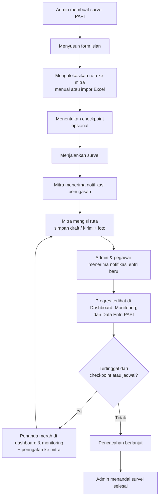
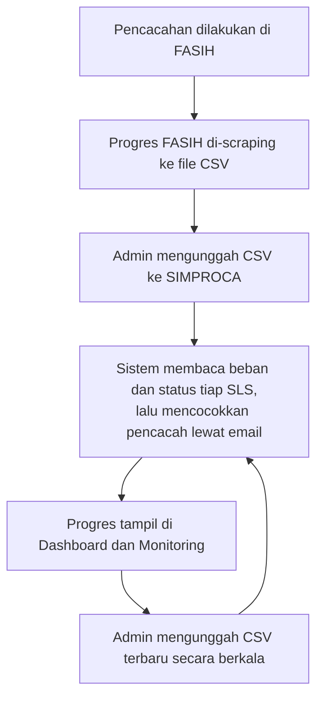

# Penjelasan Proyek Aplikasi SIMPROCA

**SIMPROCA** (Sistem Monitoring Progres Pencacahan) adalah aplikasi web untuk memantau kemajuan pencacahan survei di BPS Kabupaten Kepulauan Seribu. Dokumen ini menjelaskan latar belakang, tujuan, pengguna, fitur, dan alur kerja aplikasi. Rincian teknis ada di [architecture.md](architecture.md), rancangan basis data di [erd.md](erd.md), dan cara instalasi di [README.md](README.md).

---

## 1. Latar belakang

Dalam setiap survei, BPS dibantu oleh **mitra statistik** yang mendatangi rumah tangga (ruta) untuk melakukan pencacahan. Pegawai BPS perlu tahu setiap saat berapa ruta yang sudah dicacah, mitra mana yang tertinggal, dan wilayah mana yang belum tersentuh.

Kesulitannya, progres pencacahan datang dari dua sumber yang berbeda:

- **Survei PAPI** (*Paper and Pencil Interviewing*) memakai kuesioner kertas. Progresnya biasanya dilaporkan manual, misalnya lewat pesan atau rekap spreadsheet, sehingga sulit dipantau tepat waktu dan sulit diperiksa kebenarannya.
- **Survei CAPI** (*Computer Assisted Personal Interviewing*) dicacah di tablet dengan aplikasi FASIH. Progresnya tersedia di FASIH, tetapi terpisah dari survei PAPI dan tidak langsung terhubung dengan data mitra di kantor.

Akibatnya, pemantauan tersebar di banyak tempat, dan keterlambatan sering baru ketahuan menjelang tenggat.

## 2. Tujuan

SIMPROCA dibuat untuk:

1. **Menyatukan pemantauan** survei PAPI dan CAPI dalam satu tempat.
2. **Mencatat progres PAPI langsung dari mitra**, lengkap dengan isian variabel dan foto bukti pencacahan, sehingga setiap ruta yang dilaporkan bisa ditelusuri.
3. **Merangkum progres CAPI** dari file hasil scraping FASIH tanpa input ulang.
4. **Mendeteksi keterlambatan lebih awal** lewat target bertahap (checkpoint), penanda survei yang tertinggal jadwal, dan pengingat otomatis ke mitra.
5. **Menyajikan progres per wilayah dan per mitra**, dari tingkat kecamatan sampai SLS.

## 3. Ruang lingkup dan batasan

**Cakupan**
- Wilayah BPS Kabupaten Kepulauan Seribu (kode `3101`): 2 kecamatan beserta desa/pulau dan SLS-nya.
- Survei PAPI (diisi mitra di SIMPROCA) dan survei CAPI (progres dari FASIH).
- Tiga jenis pengguna: admin, pegawai BPS, dan mitra.
- Aplikasi web yang bisa dibuka lewat komputer maupun browser di HP.

**Batasan**
- SIMPROCA **tidak menggantikan FASIH**. Data CAPI tetap dicacah di FASIH; SIMPROCA hanya membaca file progres hasil scraping yang diunggah admin.
- SIMPROCA **tidak memeriksa kualitas isi kuesioner**. Isian variabel hanya diperiksa kelengkapan dan formatnya (misalnya harus angka).
- Tidak ada aplikasi mobile khusus; mitra memakai browser.

---

## 4. Pengguna dan perannya

| Peran | Siapa | Yang dilakukan di SIMPROCA |
| --- | --- | --- |
| **Admin** | Pengelola sistem di BPS | Membuat dan mengatur survei, mengalokasikan ruta ke mitra, menentukan checkpoint, mengimpor data FASIH, mengelola akun pengguna, memantau log aktivitas |
| **Pegawai BPS** | Penanggung jawab dan pengawas survei | Memantau dashboard dan monitoring, melihat daftar survei serta data entri mitra, mengunduh laporan. Hanya bisa melihat, tidak bisa mengubah |
| **Mitra** | Petugas pencacah lapangan | Melihat survei yang ditugaskan, mengisi ruta PAPI beserta foto bukti, memantau progres pribadinya |

Setiap akun hanya punya satu peran. Admin bisa menonaktifkan akun kapan saja, dan akun nonaktif langsung tidak bisa dipakai lagi.

---

## 5. Istilah yang dipakai

| Istilah | Arti |
| --- | --- |
| **Ruta** | Rumah tangga, yaitu satuan yang dicacah. Satu ruta = satu entri di SIMPROCA |
| **SLS** | Satuan Lingkungan Setempat (setingkat RT/RW), unit wilayah terkecil |
| **Alokasi** | Daftar ruta yang ditugaskan ke seorang mitra pada satu survei |
| **Beban** | Jumlah ruta atau dokumen yang harus diselesaikan |
| **Open / Draft / Selesai (Submit)** | Status ruta: belum diisi, sudah diisi sebagian, atau sudah dikirim lengkap |
| **Checkpoint** | Target capaian bertahap, misalnya "50% ruta selesai per 15 Oktober" |
| **FASIH** | Aplikasi pencacahan CAPI milik BPS |
| **PPL** | Petugas Pendataan Lapangan, yaitu mitra yang mencacah |

---

## 6. Fitur utama

### 6.1 Untuk admin

- **Pembuatan survei.** Admin memilih metode PAPI atau CAPI.
  - Survei PAPI disiapkan dalam empat langkah: informasi survei, form isian (variabel yang diisi mitra), alokasi mitra, dan checkpoint (opsional).
  - Survei CAPI cukup dibuat dengan mengunggah file CSV FASIH pertama.
- **Alokasi ruta ke mitra**, dengan dua cara:
  - **Manual**: pilih mitra, kelurahan, SLS, dan jumlah ruta. Sistem membuat ruta bernomor urut secara otomatis.
  - **Impor Excel**: unduh template, isi satu baris per ruta, lalu unggah. Seluruh baris diperiksa dulu; kalau ada satu saja yang salah, tidak ada data yang disimpan.
- **Checkpoint**: target capaian bertahap di dalam periode survei.
- **Status survei**: menjalankan survei (Draft → Berjalan) dan menandainya selesai.
- **Impor data FASIH** untuk survei CAPI. Setiap unggahan disimpan sebagai riwayat, sehingga data lama tetap bisa dilihat.
- **Manajemen pengguna**: menambah, mengubah, menonaktifkan, dan menghapus akun.
- **Daftar mitra**: survei yang sedang dan sudah dipegang setiap mitra.
- **Log aktivitas**: catatan siapa melakukan apa dan kapan.

### 6.2 Untuk admin dan pegawai

- **Dashboard**: ringkasan seluruh survei dalam satu layar.
  - Capaian gabungan survei yang sedang berjalan.
  - Status pendataan (Submit, Draft, Open, Lainnya).
  - Jumlah entri yang masuk setiap hari dalam minggu ini.
  - Capaian setiap survei, lengkap dengan sisa waktu dan penanda survei yang tertinggal jadwal.
  - Progres per kecamatan yang bisa dibuka sampai tingkat desa.
  - Daftar mitra yang belum mengirim entri dalam 3 hari.
- **Monitoring Progres**: rincian satu survei.
  - Tabel bertingkat kecamatan › desa › SLS, atau per mitra.
  - Grafik entri harian per minggu.
  - Posisi survei terhadap checkpoint, beserta mitra yang masih di bawah target.
  - Ekspor ke Excel.
- **Data Entri PAPI**: semua isian mitra dalam bentuk tabel yang bisa difilter, dicari, dan diurutkan. Halaman detail menampilkan isian lengkap dan foto bukti. Data bisa diunduh sebagai Excel atau CSV.
- **Notifikasi** setiap kali mitra mengirim entri.

### 6.3 Untuk mitra

- **Dashboard**: ringkasan progres pribadi pada semua survei yang ditugaskan.
- **Daftar Survei**: survei berjalan dan selesai. Di halaman survei, mitra melihat:
  - progres dan sisa ruta;
  - peringatan kalau capaiannya di bawah checkpoint;
  - target berikutnya;
  - daftar ruta yang perlu diisi.
- **Form isian ruta**: identitas wilayah (otomatis terisi untuk ruta hasil alokasi), variabel survei, dan foto bukti. Isian bisa **disimpan sebagai draft** lalu dilanjutkan nanti, dan **dikirim** setelah lengkap. Entri yang sudah dikirim terkunci.
- **Data Entri**: daftar entri yang sudah dikirim beserta detailnya.
- **Notifikasi**: penugasan survei baru, pengingat harian, pengingat 3 hari sebelum tenggat, dan peringatan kalau capaian di bawah checkpoint.

---

## 7. Alur kerja

### 7.1 Survei PAPI

### 7.2 Survei CAPI

### 7.3 Pengingat otomatis

Setiap hari sistem mengirim notifikasi secara otomatis:

| Waktu | Pengingat | Penerima |
| --- | --- | --- |
| 08.00 | Pengingat harian untuk memperbarui progres | Mitra yang masih punya ruta belum selesai |
| 08.15 | Pengingat tenggat (3 hari sebelum survei berakhir) | Mitra yang belum mencapai target |
| 08.20 | Peringatan checkpoint | Mitra yang capaiannya di bawah target checkpoint yang sudah lewat |

---

## 8. Manfaat

| Bagi | Manfaat |
| --- | --- |
| **Pimpinan dan pegawai BPS** | Satu tempat untuk memantau semua survei; keterlambatan terlihat lebih awal lewat checkpoint dan penanda jadwal; laporan siap unduh |
| **Admin** | Penyiapan survei dan alokasi ruta lebih cepat lewat template Excel; data FASIH tidak perlu diketik ulang; riwayat perubahan tercatat |
| **Mitra** | Tahu persis ruta mana yang harus dicacah dan berapa targetnya; isian bisa dicicil sebagai draft; pengingat membantu menjaga jadwal |
| **Kualitas data** | Setiap ruta yang dilaporkan punya identitas wilayah, isian lengkap, dan foto bukti; entri terkirim tidak bisa diubah; angka di semua halaman dihitung dari sumber yang sama |

---

## 9. Keamanan dan keandalan data

- **Hak akses per peran.** Mitra hanya bisa melihat dan mengisi ruta miliknya sendiri, dan pegawai hanya bisa melihat.
- **Login aman.** Percobaan login dibatasi 10 kali per menit. Akun yang dinonaktifkan atau dicabut perannya langsung keluar dari sistem.
- **Entri terkunci setelah dikirim**, sehingga data yang sudah dilaporkan tidak bisa diubah diam-diam.
- **Validasi impor menyeluruh.** Satu baris salah membatalkan seluruh impor, sehingga tidak ada data setengah jadi.
- **Aturan konsistensi data.** Contohnya: tidak boleh ada ruta ganda, target mitra tidak boleh lebih kecil dari ruta yang dipegangnya, dan checkpoint harus berada di dalam periode survei.
- **Survei hanya ditutup oleh admin**, tidak pernah otomatis.
- **Jejak audit** untuk setiap perubahan penting di log aktivitas.
- **Pengujian otomatis**: 64 skenario uji mencakup alur admin, pegawai, dan mitra, impor data, notifikasi, pengingat, dashboard, dan konsistensi data.

---

## 10. Teknologi

| Komponen | Teknologi |
| --- | --- |
| Aplikasi | Laravel 12 (PHP 8.2) |
| Basis data | MySQL |
| Tampilan | Blade dengan CSS dan JavaScript sendiri, mendukung mode gelap dan layar HP |
| Impor dan ekspor | Excel dan CSV (Maatwebsite Excel) |
| Hak akses | Spatie Laravel Permission (peran) |
| Pengingat otomatis | Laravel Scheduler |

---

## 11. Pengembangan lanjutan

Beberapa hal yang bisa dikembangkan berikutnya:

1. **Integrasi langsung dengan FASIH**, supaya progres CAPI tidak perlu diunggah manual dalam bentuk CSV.
2. **Fitur lupa password** untuk semua pengguna.
3. **Isian Kode NKS** pada form mitra dan template alokasi, kalau survei membutuhkannya. Kolomnya sudah tersedia di basis data.
4. **Notifikasi lewat WhatsApp atau email**, memanfaatkan nomor WhatsApp yang sudah tercatat di akun pengguna.
5. **Pemeriksaan kualitas isian**, misalnya rentang nilai yang wajar untuk variabel angka.
