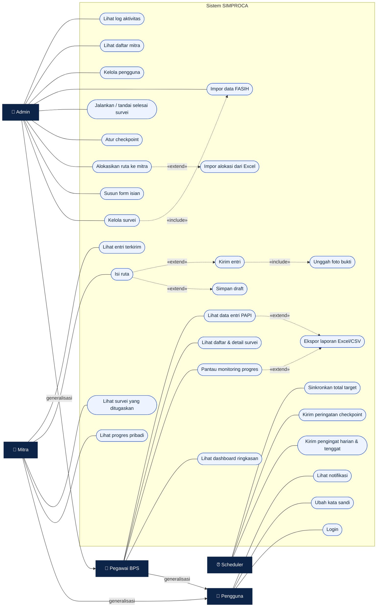
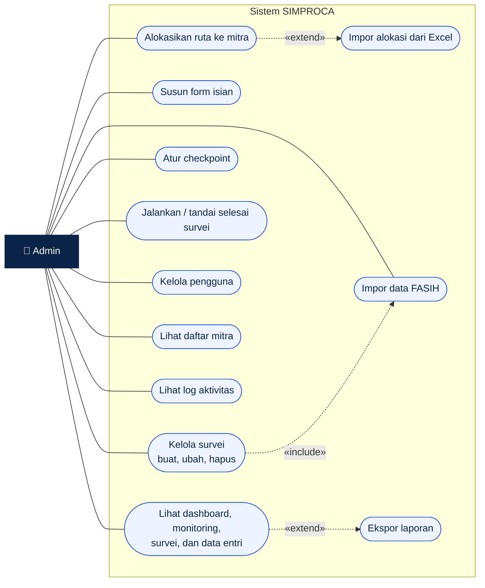
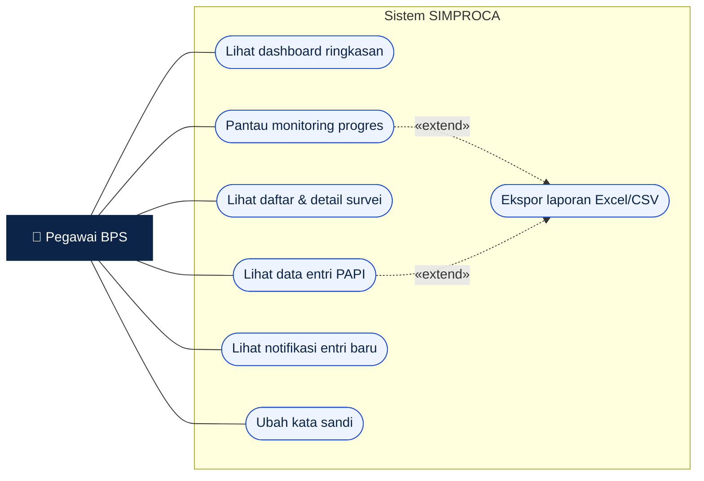
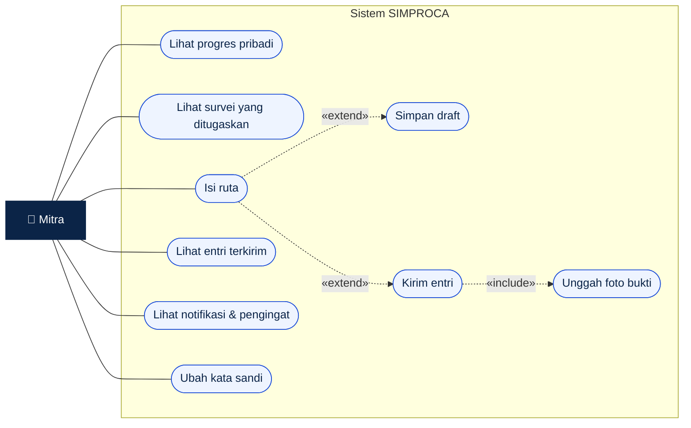

# Use Case dan Activity Diagram SIMPROCA

Dokumen ini berisi use case diagram dan activity diagram SIMPROCA dalam format [Mermaid](https://mermaid.js.org). Diagram bisa dilihat langsung di GitHub, di VS Code (dengan ekstensi *Markdown Preview Mermaid Support*), atau di [mermaid.live](https://mermaid.live) untuk diekspor menjadi PNG/SVG.

Mermaid tidak memiliki jenis diagram khusus untuk use case, jadi use case diagram digambar dengan `flowchart` mengikuti notasi UML:

| Notasi | Arti |
| --- | --- |
| Kotak aktor di luar batas sistem | Aktor |
| Bentuk lonjong di dalam kotak "Sistem SIMPROCA" | Use case |
| Garis penuh | Aktor terlibat dalam use case |
| Garis putus-putus berlabel `«include»` | Use case selalu menjalankan use case lain |
| Garis putus-putus berlabel `«extend»` | Use case tambahan yang dijalankan pada kondisi tertentu |
| Panah berlabel "generalisasi" | Aktor mewarisi seluruh use case aktor induknya |

---

## 1. Use case diagram

### 1.1 Aktor

| Aktor | Keterangan |
| --- | --- |
| **Pengguna** | Aktor umum (induk) untuk semua akun yang bisa login |
| **Admin** | Pengelola sistem; mewarisi semua use case Pegawai BPS |
| **Pegawai BPS** | Pemantau survei; hanya melihat |
| **Mitra** | Petugas pencacah lapangan |
| **Scheduler** | Aktor waktu (sistem terjadwal) yang menjalankan pengingat otomatis |

### 1.2 Diagram keseluruhan

> Relasi `Kelola survei «include» Impor data FASIH` berlaku saat admin membuat survei CAPI, karena survei CAPI wajib disertai file CSV FASIH pertama.

### 1.3 Diagram per aktor

Diagram keseluruhan cukup padat, jadi berikut versi per aktor yang lebih mudah dibaca untuk dokumen skripsi.

**Admin**

**Pegawai BPS**

**Mitra**

### 1.4 Deskripsi singkat use case

| Use case | Aktor | Deskripsi |
| --- | --- | --- |
| Login | Semua pengguna | Masuk dengan email dan kata sandi; diarahkan ke dashboard sesuai peran |
| Ubah kata sandi | Semua pengguna | Mengganti kata sandi dengan memasukkan kata sandi lama |
| Lihat notifikasi | Semua pengguna | Membuka daftar notifikasi; notifikasi otomatis ditandai dibaca |
| Kelola survei | Admin | Membuat survei PAPI/CAPI, mengubah informasi survei, atau menghapusnya |
| Susun form isian | Admin | Menambah, mengubah, dan menghapus variabel yang diisi mitra |
| Alokasikan ruta ke mitra | Admin | Menugaskan ruta per kelurahan dan SLS ke mitra; ruta diberi nomor urut otomatis |
| Impor alokasi dari Excel | Admin | Mengganti seluruh alokasi dengan isi template Excel |
| Atur checkpoint | Admin | Menentukan target capaian bertahap di dalam periode survei |
| Jalankan / tandai selesai survei | Admin | Mengubah status survei; mitra diberi notifikasi saat survei dijalankan |
| Impor data FASIH | Admin | Mengunggah CSV progres FASIH untuk survei CAPI |
| Kelola pengguna | Admin | Menambah, mengubah, menonaktifkan, dan menghapus akun |
| Lihat daftar mitra | Admin | Melihat survei yang sedang dan sudah dipegang setiap mitra |
| Lihat log aktivitas | Admin | Menelusuri riwayat perubahan data |
| Lihat dashboard ringkasan | Admin, Pegawai | Ringkasan capaian seluruh survei |
| Pantau monitoring progres | Admin, Pegawai | Rincian progres satu survei per wilayah dan per mitra |
| Lihat data entri PAPI | Admin, Pegawai | Tabel isian mitra beserta detail dan foto bukti |
| Ekspor laporan | Admin, Pegawai | Mengunduh rekap monitoring atau data entri dalam Excel/CSV |
| Isi ruta | Mitra | Mengisi identitas ruta dan variabel survei |
| Simpan draft | Mitra | Menyimpan isian sebagian untuk dilanjutkan nanti |
| Kirim entri | Mitra | Mengirim isian lengkap beserta foto; entri terkunci setelah terkirim |
| Lihat entri terkirim | Mitra | Melihat daftar dan detail entri yang sudah dikirim |
| Kirim pengingat harian & tenggat | Scheduler | Pengingat 08.00 dan pengingat H-3 ke mitra yang belum tuntas |
| Kirim peringatan checkpoint | Scheduler | Peringatan 08.20 ke mitra yang capaiannya di bawah checkpoint yang sudah lewat |
| Sinkronkan total target | Scheduler | Menghitung ulang total target survei berjalan setiap jam |

---

## 2. Activity diagram

Notasi activity diagram:

| Notasi | Arti |
| --- | --- |
| ● (lingkaran hitam) | Titik mulai |
| ◉ (lingkaran ganda) | Titik selesai |
| Kotak membulat | Aktivitas |
| Belah ketupat | Keputusan |
| Kolom (swimlane) | Pelaku aktivitas |

### 2.1 Login

```mermaid
flowchart TD
    start(( )) --> A[Buka halaman login]
    subgraph Pengguna
        A --> B[Isi email dan kata sandi]
        B --> C[Klik Masuk]
    end
    subgraph Sistem
        C --> D{Lebih dari 10 percobaan<br/>dalam 1 menit?}
        D -- Ya --> E[Tolak sementara<br/>terlalu banyak percobaan]
        D -- Tidak --> F{Email dan kata<br/>sandi cocok?}
        F -- Tidak --> G[Tampilkan pesan<br/>email atau password tidak valid]
        F -- Ya --> H{Akun aktif dan<br/>punya peran?}
        H -- Tidak --> I[Keluarkan sesi dan tampilkan<br/>akun nonaktif / belum punya peran]
        H -- Ya --> J{Peran?}
        J -- Admin --> K[Buka dashboard admin]
        J -- Pegawai BPS --> L[Buka dashboard pegawai]
        J -- Mitra --> M[Buka dashboard mitra]
    end
    G --> B
    I --> B
    E --> stop((( )))
    K --> stop
    L --> stop
    M --> stop

    classDef dot fill:#0b2447,stroke:#0b2447
    class start,stop dot
```

### 2.2 Admin menyiapkan survei PAPI

```mermaid
flowchart TD
    start(( )) --> A
    subgraph Admin
        A[Isi judul, periode, deskripsi<br/>pilih metode PAPI] --> A2[Simpan survei]
        V[Tambah variabel isian<br/>nama, tipe teks/angka, contoh]
        C1{Cara alokasi?}
        M1[Pilih mitra, kelurahan,<br/>SLS, dan jumlah ruta]
        X1[Unduh template, isi,<br/>lalu unggah file Excel]
        CP{Perlu checkpoint?}
        CP1[Tambah tanggal dan<br/>target persen]
        R[Klik Selesai setup]
    end
    subgraph Sistem
        A2 --> S1{Judul unik dan<br/>periode valid?}
        S1 -- Tidak --> S1E[Tampilkan pesan kesalahan]
        S1 -- Ya --> S2[Simpan survei berstatus Draft]
        M2{Nomor urut SLS<br/>masih ≤ 99?}
        M3[Buat ruta Open bernomor urut<br/>dan tambah target mitra]
        X2{Semua baris valid dan<br/>belum ada ruta terisi?}
        X3[Ganti seluruh alokasi<br/>dengan ruta dari file]
        XE[Tolak impor<br/>tampilkan daftar kesalahan]
        CP2{Tanggal di dalam<br/>periode survei?}
        CP3[Simpan checkpoint]
        R1{Minimal satu<br/>alokasi mitra?}
        R2[Hitung ulang total target<br/>status menjadi Berjalan]
        R3[Kirim notifikasi penugasan<br/>ke setiap mitra]
    end
    S1E --> A
    S2 --> V
    V --> C1
    C1 -- Manual --> M1 --> M2
    M2 -- Tidak --> M1
    M2 -- Ya --> M3 --> CP
    C1 -- Impor Excel --> X1 --> X2
    X2 -- Tidak --> XE --> X1
    X2 -- Ya --> X3 --> CP
    CP -- Ya --> CP1 --> CP2
    CP2 -- Tidak --> CP1
    CP2 -- Ya --> CP3 --> R
    CP -- Tidak --> R
    R --> R1
    R1 -- Tidak --> C1
    R1 -- Ya --> R2 --> R3 --> stop((( )))

    classDef dot fill:#0b2447,stroke:#0b2447
    class start,stop dot
```

### 2.3 Mitra mengisi ruta PAPI

```mermaid
flowchart TD
    start(( )) --> A
    subgraph Mitra
        A[Buka Daftar Survei<br/>pilih survei berjalan] --> B{Ruta yang dikerjakan?}
        B -- Ruta Open / Draft --> C[Buka ruta dari daftar]
        B -- Ruta baru --> D[Klik Isi ruta baru]
        F[Isi identitas ruta,<br/>variabel, dan foto bukti]
        G{Simpan draft<br/>atau kirim?}
    end
    subgraph Sistem
        D --> D1{Jumlah entri masih<br/>di bawah target?}
        D1 -- Tidak --> D2[Tolak: seluruh target<br/>sudah punya entri]
        D1 -- Ya --> E[Tampilkan form isian kosong]
        C --> C1[Tampilkan form<br/>identitas alokasi terkunci]
        H{Variabel angka<br/>berformat benar?}
        I[Simpan sebagai Draft]
        J{Identitas, semua variabel,<br/>dan foto lengkap?}
        K[Simpan sebagai Selesai<br/>catat waktu kirim]
        L[Tambah progres mitra +1<br/>entri terkunci]
        N[Kirim notifikasi ke admin<br/>dan pegawai, catat log]
        ERR[Tampilkan pesan kesalahan]
    end
    D2 --> A
    E --> F
    C1 --> F
    F --> G
    G -- Simpan draft --> H
    G -- Kirim --> H
    H -- Tidak --> ERR --> F
    H -- Ya, draft --> I --> stop((( )))
    H -- Ya, kirim --> J
    J -- Tidak --> ERR
    J -- Ya --> K --> L --> N --> stop

    classDef dot fill:#0b2447,stroke:#0b2447
    class start,stop dot
```

### 2.4 Admin mengimpor data FASIH (survei CAPI)

```mermaid
flowchart TD
    start(( )) --> A
    subgraph Admin
        A[Scraping progres dari FASIH<br/>menjadi file CSV] --> B[Buka Monitoring Progres<br/>pilih survei CAPI berjalan]
        B --> C[Unggah file CSV]
    end
    subgraph Sistem
        C --> D{Survei CAPI, berjalan,<br/>dan file CSV ≤ 10 MB?}
        D -- Tidak --> DE[Tolak unggahan]
        D -- Ya --> E{Kolom wajib ada?<br/>email, regionCode,<br/>totalRegion, statusBreakdown}
        E -- Tidak --> EE[Tampilkan baris dan<br/>kolom yang bermasalah]
        E -- Ya --> F[Bersihkan kode wilayah dan<br/>kelompokkan status ke<br/>Open / Draft / Submit / Lainnya]
        F --> G[Cocokkan pencacah dengan<br/>akun lewat email]
        G --> H[Simpan sebagai snapshot baru]
        H --> I[Hitung ulang total target<br/>dari snapshot terbaru]
        I --> J[Tampilkan progres terbaru<br/>di Dashboard dan Monitoring]
    end
    DE --> B
    EE --> C
    J --> stop((( )))

    classDef dot fill:#0b2447,stroke:#0b2447
    class start,stop dot
```

### 2.5 Pegawai memantau progres

```mermaid
flowchart TD
    start(( )) --> A
    subgraph Pegawai
        A[Buka Dashboard] --> B{Ada survei tertinggal<br/>atau mitra belum update?}
        B -- Ya --> C[Buka survei tersebut<br/>di Monitoring]
        B -- Tidak --> C
        D{Tampilan?}
        E[Buka kecamatan › desa › SLS]
        F[Buka mitra › SLS yang dipegang]
        G{Perlu laporan?}
        H[Klik Unduh Excel]
        I[Buka Data Entri PAPI<br/>untuk melihat isian dan foto]
    end
    subgraph Sistem
        C --> S1[Hitung progres dari alokasi & entri PAPI<br/>atau snapshot FASIH terbaru]
        S1 --> S2[Tampilkan total, grafik entri harian,<br/>dan posisi terhadap checkpoint]
        S3[Buat file Excel sesuai<br/>tingkat dan filter aktif]
    end
    S2 --> D
    D -- Wilayah --> E --> G
    D -- Mitra --> F --> G
    G -- Ya --> H --> S3 --> stop((( )))
    G -- Tidak --> I --> stop

    classDef dot fill:#0b2447,stroke:#0b2447
    class start,stop dot
```

### 2.6 Pengingat dan peringatan otomatis

```mermaid
flowchart TD
    start(( )) --> T{Jam berapa?}
    subgraph Scheduler
        T -- "08.00" --> A1[Cari mitra aktif dengan alokasi<br/>belum tuntas di survei berjalan]
        A1 --> A2[Kirim pengingat harian]
        T -- "08.15" --> B1[Cari survei berjalan yang<br/>berakhir 3 hari lagi]
        B1 --> B2[Kirim pengingat tenggat ke mitra<br/>yang belum mencapai target]
        T -- "08.20" --> C1[Cari checkpoint yang sudah lewat<br/>dan belum pernah diperingatkan]
        C1 --> C2{Ada mitra dengan capaian<br/>di bawah target checkpoint?}
        C2 -- Ya --> C3[Kirim peringatan checkpoint<br/>ke mitra tersebut]
        C2 -- Tidak --> C4
        C3 --> C4[Tandai checkpoint<br/>sudah diperingatkan]
        T -- "setiap jam" --> D1[Hitung ulang total target<br/>survei berjalan]
    end
    A2 --> stop((( )))
    B2 --> stop
    C4 --> stop
    D1 --> stop

    classDef dot fill:#0b2447,stroke:#0b2447
    class start,stop dot
```

